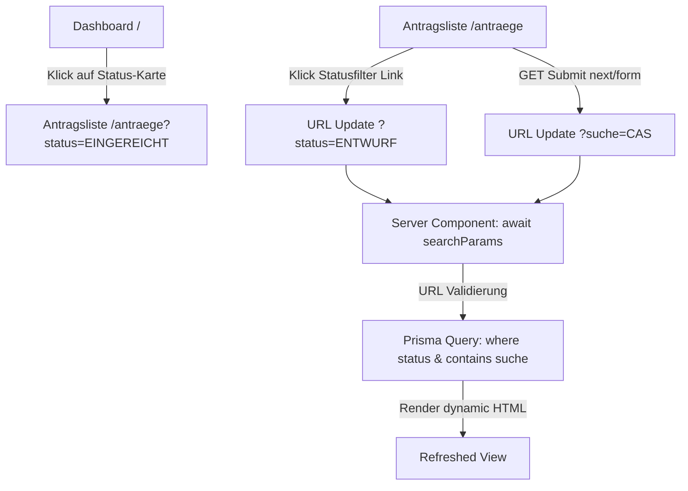

# Developer Notes: Meine Antraege und Statusuebersicht

## Überblick

Dieses Feature erweitert das Dashboard (`/`) und die Antragsliste (`/antraege`) um URL-basierte Filter- und Suchmöglichkeiten. Es wurde ohne Client-seitigen State vollständig auf Basis von Next.js Server Components und URL-Search-Params implementiert.

## Referenzen

- Plan: `docs/project/features/meine-antraege-und-statusuebersicht/plan-v002.md`
- PRD: `docs/project/prds/self-service-portal-v002.md` (US-5, MVP-Priorität 3)
- Coding-Konventionen: `KILO_INSTRUCTIONS.md`

## Betroffene Dateien

| Datei | Zweck / Änderung |
|---|---|
| [antrag-status.ts](file:///c:/Users/bjoer/Documents/repos/cas-prdig-demo-starter-kit-self-service-portal/src/lib/antrag-status.ts) | Definition des Arrays `ANTRAG_STATUS_MVP` für die anzuzeigenden Filter-Buttons. |
| [antrag-status.test.ts](file:///c:/Users/bjoer/Documents/repos/cas-prdig-demo-starter-kit-self-service-portal/__tests__/unit/antrag-status.test.ts) | Unit-Tests zur Absicherung der `ANTRAG_STATUS_MVP` Konstante. |
| [antraege/page.tsx](file:///c:/Users/bjoer/Documents/repos/cas-prdig-demo-starter-kit-self-service-portal/src/app/(app)/antraege/page.tsx) | Server Component: Auslesen von `searchParams` (Promise), URL-Validierung gegen das gesamte `AntragStatus` Enum, Erweiterung der Prisma-Query (`where.status`, `where.titel.contains`), Rendering der Filter-Buttons, der `next/form` Suche und der neuen "Kosten"-Spalte. |
| [dashboard/page.tsx](file:///c:/Users/bjoer/Documents/repos/cas-prdig-demo-starter-kit-self-service-portal/src/app/(app)/page.tsx) | Server Component: Dashboard-Karten als block-Links zu `/antraege` mit entsprechenden Query-Parametern verpackt und Hover-Stile (`hover:bg-muted/50`, `cursor-pointer`) hinzugefügt. |
| [antraege.spec.ts](file:///c:/Users/bjoer/Documents/repos/cas-prdig-demo-starter-kit-self-service-portal/e2e/antraege.spec.ts) | Playwright E2E-Tests für Statusfilter und Suche. |

## Architektur und Datenfluss

Die Filterung nutzt die URL als Single Source of Truth.
- **Filter-Links:** Erstellen `Link`-Ziele mit der Kombination aus aktuellem Status und Suchbegriff.
- **Titelsuche:** Nutzt Next.js `<Form>` (`next/form`), welches bei GET-Submits automatisch eine weiche Client-Side-Navigation durchführt, ohne die Seite hart neu zu laden. Ein verstecktes Feld sichert das Mitführen des Statusfilters bei einer neuen Suche.
- **URL-Validierung:** Eingehende Status-Strings aus der URL werden gegen `Object.values(AntragStatus)` validiert. Ungültige Werte werden ignoriert (Prisma-Query filtert dann nicht nach Status).

## Rollen und Berechtigungen

- Die Zugriffskontrolle der Daten wird serverseitig über die Prisma-Query gesteuert.
- Für `user_applicant` wird immer das Feld `erstellerId: session.user.id` in die Prisma-Query aufgenommen (Regressionsschutz für Datensicherheit).
- Für `admin` und `user_reviewer` wird das Filterfeld weggelassen, wodurch alle Anträge durchsucht und gefiltert werden.

## Datenmodell und Persistenz

- Keine Schema-Änderung an `prisma/schema.prisma`.
- Das bestehende `AntragStatus` Enum wird für die serverseitige Validierung genutzt.
- Die Textsuche nutzt SQLite `contains` (case-insensitive in SQLite standardmäßig).

## Validierung und Tests

| Prüfung | Befehl | Ergebnis / Hinweis |
|---|---|---|
| Unit Tests | `npm run test` | Bestanden. Deckt ab, dass `ANTRAG_STATUS_MVP` korrekt typisiert ist und eine Teilmenge des Enums darstellt. |
| E2E Tests | `npm run test:e2e` | Bestanden. Überprüft den Login, das Klicken auf Filter-Badges und die Eingabe im Suchfeld unter Einbindung des lokalen Dev-Servers. |
| Build-Validierung | `npm run build` | Bestanden. Next.js-Kompilierung und TypeScript strict-Prüfung erfolgreich. |

## Betriebs- und Setup-Hinweise

- Das Feature benötigt keine zusätzlichen Umgebungsvariablen.
- Die Testdaten werden wie gewohnt über den Seed-Befehl `npm run db:reset` geladen.

## Wartungshinweise

- **Next.js 16 Search Params Gotcha:** Beachten Sie, dass in Next.js 16 `searchParams` ein Promise ist. Im Page-Komponenten-Code muss es per `const { status, suche } = await searchParams` ausgelesen werden.
- **next/form:** Verwenden Sie für Such-Formulare immer `Form` aus `next/form` anstelle des Standard `<form>`, um harte Page-Reloads bei GET-Anfragen zu vermeiden.
